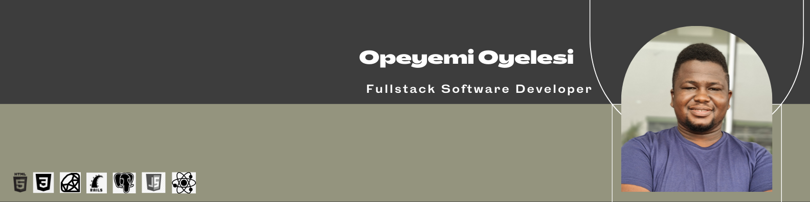

### Hi there 👋

:man_technologist: I’m a student at [Microverse](https://www.microverse.org/) learning and building applications.

- Currently learning:

    - [x] HTML & CSS (+ Bootstrap);
    - [x] Ruby; 
    - [x] SQL and Database;
    - [x] Ruby on Rails;
    - [x] JavaScript;
    - [ ] React & Redux;
        
 

    
    

> *My "Most Used Languages" does not indicate my skill level, it's just a GitHub metric of which languages have the most code on my GitHub repositories.*
 

 
    
## Some of my project

These are some of my favorite projects, please take a look at them:

    
     

    
    

 
    
<strong>Contact me</strong>

I love the excitement and opportunities to learn and grow that comes with new challenges and I always seek them

    
    
    

 
<!-- bg-color: fff -->
